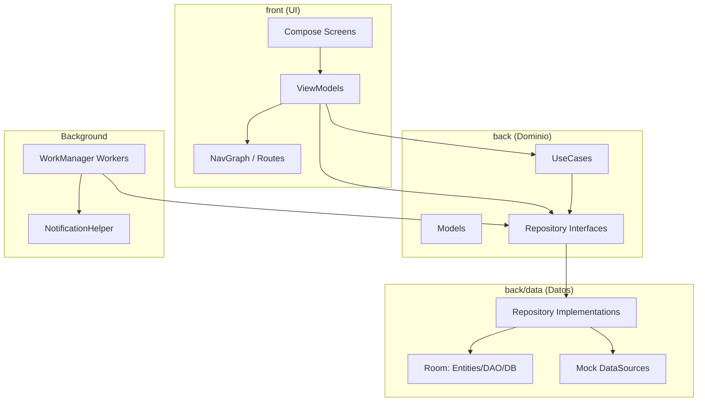
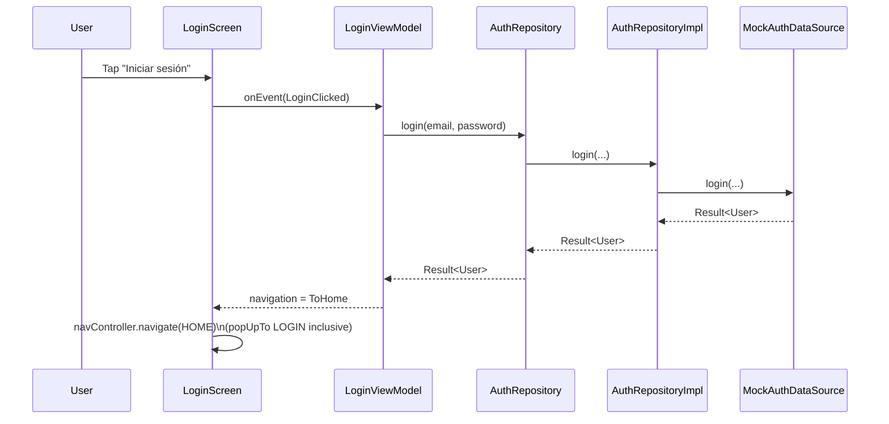
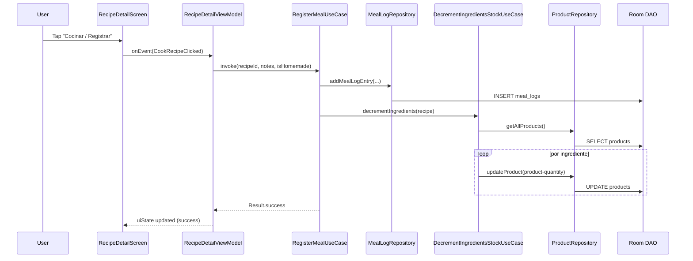
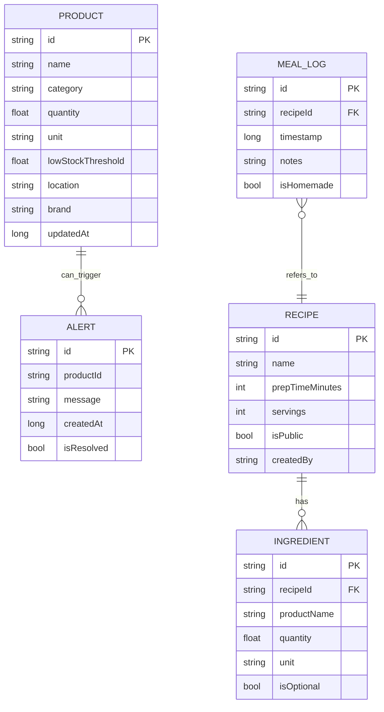

# PantryChef

> **Android app (Jetpack Compose)** para gestionar tu **despensa**, **recetas**, **lista de la compra** y un registro básico de comidas, con alertas de stock bajo y tareas en segundo plano.

---

## Tabla de contenidos
- [Descripción](#descripción)
- [Características](#características)
- [Stack tecnológico](#stack-tecnológico)
- [Arquitectura](#arquitectura)
  - [Separación front/back dentro del proyecto](#separación-frontback-dentro-del-proyecto)
  - [Estructura de carpetas](#estructura-de-carpetas)
  - [Diagramas](#diagramas)
- [Instalación](#instalación)
- [Requisitos](#requisitos)
- [Flujos clave](#flujos-clave)
- [Decisiones de diseño](#decisiones-de-diseño)
- [Testing](#testing)

---

## Descripción
**PantryChef** busca resolver el “¿qué puedo cocinar con lo que tengo?” combinando:
- Inventario de productos (despensa) con cantidades y umbrales de stock bajo.
- Recetas con ingredientes (nombre, cantidad y unidad).
- Cálculo de **recetas cocinables** y **casi cocinables** según tu stock.
- Lista de compra sugerida (por stock bajo y recetas casi cocinables).
- Registro básico de comidas y descuento automático de stock al “cocinar” una receta.

---

## Características
- **Auth (mock)**: login/registro en memoria (estructura preparada para evolucionar a Firebase).
- **Despensa**:
  - CRUD de productos (Room)
  - búsqueda / categorías
  - umbral de stock bajo
- **Recetas**:
  - CRUD de recetas e ingredientes (Room)
  - detalle de receta
  - cálculo de “cocinables” / “casi cocinables”
- **Cocinar receta**:
  - registra comida (MealLog)
  - descuenta stock automáticamente
- **Lista de la compra**:
  - items sugeridos y manuales (Room)
  - marcar comprado
  - mover items comprados a despensa
- **Background** (WorkManager):
  - recordatorio diario
  - chequeo periódico de stock bajo + notificación

---

## Stack tecnológico
- **Kotlin**
- **Jetpack Compose** (UI)
- **MVVM** (ViewModel + UiState)
- **Kotlin Coroutines + Flow**
- **Room** (persistencia local)
- **Hilt** (inyección de dependencias)
- **WorkManager** (tareas en segundo plano)
- Estructura pensada para futura integración en **Firebase Auth / Firestore** (aún sin implementación real en repos)

---

## Arquitectura

### Separación front/back dentro del proyecto
El código está dividido por intención:

- `front/`: UI + navegación + ViewModels
  - Screens (Compose)
  - eventos y estado (UiState)
  - navegación (NavHost + Routes)
- `back/`: datos + dominio + utilidades
  - `model/` (entidades de dominio)
  - `repository/` (interfaces)
  - `data/` (implementaciones: Room, mocks, mappers)
  - `usecase/` (casos de uso)
  - `worker/` (WorkManager)
  - `utils/` (conversión de unidades, notificaciones, etc.)

---

### Estructura de carpetas
(Resumen orientativo)

```
app/src/main/java/com/pantrychef/
├── front/
│   ├── auth/              # Login/Register (mock)
│   ├── home/              # Dashboard: cocinables, casi cocinables, alertas, preview lista
│   ├── pantry/            # Despensa (CRUD)
│   ├── recipes/           # Recetas (CRUD, detalle)
│   ├── shoppinglist/      # Lista de compra
│   ├── settings/          # Ajustes (parcial / placeholders)
│   ├── navigation/        # Routes + NavGraph
│   ├── components/        # UI reusable (rows, badges, etc.)
│   └── theme/
└── back/
    ├── di/                # módulos Hilt
    ├── model/             # Product, Recipe, Ingredient, Alert, MealLog, ...
    ├── repository/        # interfaces repositorio
    ├── data/
    │   ├── local/         # Room DB, DAO, entities, seed helper
    │   ├── mapper/        # entity <-> model
    │   ├── mock/          # seeds / fuentes mock
    │   └── firebase/      # (carpeta presente, sin implementación real)
    ├── usecase/           # casos de uso (cookable, decrement stock, build shopping list, etc.)
    ├── worker/            # DailyReminderWorker, LowStockCheckWorker
    └── utils/
```

---

## Diagramas

### Arquitectura general (capas)


### Secuencia: Login (mock)


### Secuencia: Cocinar receta → registrar comida + descontar stock


### ER básico (Room)


---

## Instalación
1. Clona el repositorio:
   ```bash
   git clone <repo-url>
   ```
2. Abre el proyecto en **Android Studio**.
3. Espera a que Gradle sincronice dependencias.
4. Ejecuta la app en un emulador o dispositivo.

---

## Requisitos
- **Android Studio** (recomendado: última versión estable)
- **JDK 17** (o el que recomiende tu Android Studio para AGP)
- **minSdk 24**
- **targetSdk 35
- Dispositivo/emulador Android compatible

---

## Flujos clave

### 1) Gestión de despensa (CRUD)
- Crear/editar producto
- Ajustar cantidad
- Umbral de “stock bajo”
- Persistencia en Room

### 2) Descubrir recetas cocinables / casi cocinables
- La Home calcula:
  - **Cookable**: ingredientes cubiertos por tu stock
  - **Almost cookable**: falta poco (según lógica del caso de uso)

### 3) Cocinar receta → actualizar inventario
- Desde el detalle de receta:
  - se registra un `MealLog`
  - se descuenta stock por ingrediente

### 4) Lista de la compra sugerida
- Sugerencias por:
  - productos bajo umbral
  - recetas casi cocinables
- Marcar items como comprados
- “Mover a despensa” (añade/actualiza productos y elimina items comprados)

### 5) Background: notificaciones
- Recordatorio diario de registro
- Chequeo periódico de stock bajo

---

## Decisiones de diseño
- **MVVM + UiState** para separar UI/estado y facilitar testabilidad.
- **UseCases** para encapsular lógica de negocio (cálculos de recetas, decremento stock, sugerencias).
- **Room + mappers** para mantener modelos de dominio (`back/model`) separados de entidades (`back/data/local/entity`).
- **Flow** como canal reactivo principal: al cambiar la DB, se actualiza la UI.
- **Hilt** para inyección (repos/usecases/workers).
- **WorkManager** para tareas fiables (sobre todo en background).

---

## Testing
Hay tests unitarios en `app/src/test/` (por ejemplo, casos de uso de recetas y decremento de stock).

Ejecutar tests:
```bash
./gradlew test
```

---


